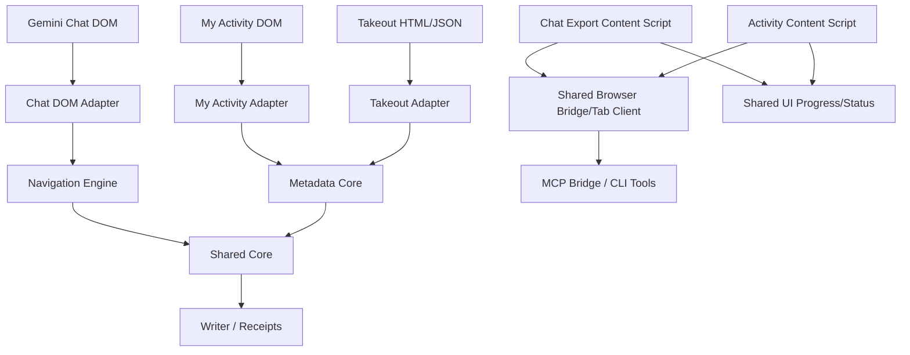

# TypeScript Shared Core, Navigation, Tabs And DOM Adapter Refactor Implementation Plan

> **For agentic workers:** REQUIRED SUB-SKILL: Use `superpowers:subagent-driven-development` (recommended) or `superpowers:executing-plans` to implement this plan task-by-task. Steps use checkbox (`- [ ]`) syntax for tracking.

**Goal:** Refatorar o exporter para um stack TypeScript com Biome + `tsc --noEmit`, criando um core compartilhado por Chat Export, My Activity e Takeout, com Navigation Engine, DOM adapters finos, gestão de abas compartilhada e UI comum de progresso/status.

**Architecture:** A arquitetura alvo separa seis responsabilidades: Shared Core, Browser Bridge/Tab Client, Shared UI, Navigation Engine, Source Adapters e Workflow Orchestrators. Adapters só traduzem uma superfície concreta (Gemini chat DOM, My Activity DOM, Takeout HTML/JSON) para contratos canônicos; core, bridge/tab e UI ficam compartilhados entre Chat Export, My Activity e Takeout. Nenhuma camada pode fabricar `chatId`; estado incerto vira `blocked`/`incomplete`/`unresolved`, nunca sucesso silencioso.

**Tech Stack:** TypeScript incremental, Biome para lint/format/imports, `tsc --noEmit` como typecheck oficial, `tsc -p tsconfig.build.json` para emitir ESM em `build/ts`, Node test runner via script recursivo, jsdom fixtures para DOM adapters e smoke real em Chrome/Dia sem `chatId` fixo.

---

## 0. Implementation Status - 2026-05-19

Completed in the first implementation slice:

- TypeScript/Biome tooling, `build:ts`, `typecheck`, `check`, recursive `scripts/run-tests.mjs`, and `build/` ignore.
- Shared core contracts for `ChatId`, portable ISO seconds, browser-safe text hashes, Markdown note parsing, canonical frontmatter and metadata evidence grouping.
- Shared Takeout adapter in `src/takeout/takeout-adapter.ts`, used by both `chat-metadata-backfill.mjs` and `vault-repair.mjs`.
- Metadata backfill now feeds Takeout and My Activity evidence through the same grouping path and skips My Activity when Takeout/frontmatter already cover every selected chat.
- Gemini CLI bundle now ships compiled shared TypeScript modules under `build/ts` and still excludes `docs/superpowers/**`.
- Shared browser UI `ProgressPort` in `src/browser/shared/progress-port.ts`, inlined into Chat Export and My Activity; My Activity uses it for the progress dock.
- Shared browser tab command handler in `src/browser/shared/tab-commands.ts`, inlined into Chat Export and My Activity for extension info, reload self, tab activation, claim and release commands.
- Shared browser bridge client in `src/browser/shared/bridge-client.ts`, inlined into Chat Export and My Activity for heartbeat payloads, command result cache/idempotency, command execution, SSE command/job progress consumption and bridge result posting. Chat Export still keeps its stronger reconnect/backoff loop and snapshot-specific orchestration around the shared client.
- DOM adapter contracts in `src/browser/dom-adapter/types.ts`, concrete first-pass Gemini row/route/hydration adapter in `src/browser/dom-adapter/gemini-web-current.ts`, and My Activity evidence adapter in `src/activity/activity-adapter.ts`.
- First-pass selector-free Navigation Engine in `src/browser/navigation/navigation-engine.ts`, tested with fake adapters for identity blocking, busy-tab blocking, current-chat short-circuit and exportable-row opening.
- Chat Export content script now inlines the core chat identity helper, Gemini DOM adapter and Navigation Engine, exposes `navigationState()` for debug, and routes bridge-driven `open-chat`/`get-chat-by-id`, batch export navigation and return-to-original-chat paths through the Navigation Engine while preserving the existing Gemini click/URL fallback behavior.
- Chat Export and My Activity content script sources are now TypeScript files (`src/userscript-shell.ts`, `src/activity-content-script.ts`). `scripts/build.mjs` reads the JavaScript emitted by `tsc` from `build/ts/**`, strips module-only syntax for MV3 non-module content scripts, and then writes `dist/**`. These two large legacy shells are transitional `@ts-nocheck` sources and are excluded from Biome formatting until their logic is extracted into typed modules.
- MCP export writes now pass through `src/mcp/export-workflows.ts` before filesystem writes. The validator either returns a proven `ChatSnapshot`-shaped result with sanitized integrity evidence or blocks with `identity_unproven`, `chat_id_mismatch` or `empty_chat`; recent/direct export reports carry sanitized integrity/failure evidence.
- Browser export smoke now exists as `scripts/smoke-export-integrity.mjs` / `npm run smoke:export-integrity`; it discovers the first exportable recent chat through the bridge, exports to a temp directory, and validates filename, YAML `chat_id`, URL and assistant turn count without a fixed chat id.

Still pending for later slices:

- Further bridge cleanup: move Chat Export's custom long-poll loop, reconnect/backoff policy and snapshot trigger orchestration behind the shared browser bridge client.
- Notebook return-to-page policy still uses the existing notebook return helper; later work should expose that as a Navigation Engine result instead of a shell-only object.
- Legacy cleanup is not complete: duplicate chat id extraction still exists in compatibility shells/MCP glue, and the two large content script shells remain transitional `@ts-nocheck` TypeScript while logic continues moving into typed modules.

Verification after this slice:

```bash
npm run typecheck
npm run check
npm test
npm run smoke:export-integrity -- --json
```

Expected current result: `322` tests total, `320` passing, `2` skipped. Real smoke should either pass in a ready browser session or fail with `bridge_not_ready` / `no_exportable_chat` / `validation_failed` instead of a false green.

---

## 1. Decisões Aprovadas

- O checkout atual `codex/my-activity-backfill` é a base de trabalho, mesmo com mudanças pendentes, desde que `npm test` continue passando.
- My Activity, Takeout, Chat Export, gestão de abas e UI compartilhada fazem parte do mesmo refactor.
- `docs/superpowers/**` é developer-only e não pode entrar no bundle Gemini CLI. A regressão disso vive em `tests/gemini-cli-extension.test.mjs`.
- O smoke real não exige um chat id manual do operador. Ele descobre um chat exportável via bridge/CLI ou bloqueia com diagnóstico claro.
- `src/core/**` não pode depender de DOM, Chrome APIs, bridge, filesystem, MCP, `window`, `document`, `Element` ou `MutationObserver`.
- Browser-specific shared code fica em `src/browser/shared/**`. Node-only I/O fica nos scripts/CLI ou wrappers em `src/node/**`, não no core.
- A extensão MV3 continua com content scripts não-module. Qualquer módulo TypeScript usado no browser precisa ser compilado e inlinado pelo build, como hoje acontece com `progress-dock-ui.mjs`.

## 2. Target Architecture



### Shared Core

Owns canonical data and pure rules:

- `ChatId` parsing/normalization and canonical Gemini URLs.
- portable ISO seconds, text hashes and sanitized evidence.
- frontmatter/YAML generation and Markdown note parsing.
- assistant turn counting and body section extraction.
- `ChatSnapshot`, `MarkdownChatNote`, `MetadataEvidence`, `ExportReceipt`, `BlockedResult`.
- metadata matching/grouping for My Activity and Takeout.
- export integrity validation before write.

### Browser Bridge/Tab Client

Owns browser-side bridge plumbing shared by Chat Export and My Activity:

- `bridgeRequest`, heartbeat, SSE event channel, long-poll fallback.
- command result cache and idempotent command handling.
- `GET_EXTENSION_INFO`, reload self, build/protocol info.
- `activate-browser-tab`, `claim-tab`, `release-tab-claim`.
- capability advertisement in one shape for chat and activity clients.

Page-specific content scripts only register handlers for their own commands.

### Shared UI

Owns UI primitives reused across pages:

- current shared progress dock plus a `ProgressPort` facade.
- human progress labels for chat export, MCP jobs and My Activity scan.
- shared theme variables and visibility/update behavior.
- optional shared toast/status helpers after progress is stable.

The Chat Export modal remains chat-specific. My Activity must not duplicate progress dock CSS/HTML.

### Source Adapters

Adapters read facts and produce canonical contracts:

- Chat DOM adapter returns `ChatSnapshot`, route state, hydration state and conversation rows.
- My Activity DOM adapter returns `MetadataEvidence[]` and scan progress.
- Takeout adapter returns `MetadataEvidence[]` from HTML or JSON.

Adapters do not write files, build final YAML, decide success, or synthesize chat IDs.

### Workflow Orchestrators

Navigation Engine and MCP/CLI workflows orchestrate adapters + core:

- Navigation owns retries, hydration, backoff, load-more and browser state transitions.
- Metadata backfill owns I/O, checkpoint, report path and applying core output to vault files.
- Writer owns atomic-enough Markdown + receipt writes and blocked reports.

## 3. File Structure

```txt
src/
  core/
    types.ts
    chat-id.ts
    date.ts
    text-hash.ts
    markdown-note.ts
    yaml.ts
    metadata-evidence.ts
    export-integrity.ts
    receipt.ts
    writer.ts

  browser/
    shared/
      bridge-client.ts
      tab-commands.ts
      command-dispatch.ts
      progress-port.ts
      progress-labels.ts

    dom-adapter/
      types.ts
      adapter-registry.ts
      gemini-web-current.ts
      gemini-web-current.selectors.ts
      gemini-web-current.extractors.ts

    navigation/
      types.ts
      navigation-engine.ts
      hydration.ts
      conversation-history.ts
      open-chat.ts
      retry-policy.ts

  activity/
    activity-adapter.ts
    activity-selectors.ts

  takeout/
    takeout-adapter.ts

  node/
    vault-note-io.ts
    report-writer.ts

tests/
  core/
  browser/
  activity/
  takeout/
  mcp/
```

Existing files remain as compatibility shells during migration:

- `src/extract.mjs` stays as the legacy scraper/format facade until `src/core` + chat adapter are wired into the content script build.
- `src/userscript-shell.ts` stays as the Chat Export shell.
- `src/activity-content-script.ts` stays as the My Activity shell.
- `gemini-cli-extension/scripts/chat-metadata-backfill.mjs` and `vault-repair.mjs` become Node I/O wrappers around compiled core/takeout modules.

## 4. Canonical Contracts

Create `src/core/types.ts`:

```ts
export type ChatId = string & { readonly __brand: "ChatId" };
export type IsoDateTime = string & { readonly __brand: "IsoDateTime" };

export type ChatRole = "user" | "assistant";

export type ChatTurn = {
  role: ChatRole;
  markdown: string;
  textHash: string;
  sourceOrder: number;
  attachments: ChatAttachment[];
};

export type ChatAttachment = {
  kind: "image" | "document" | "artifact" | "unknown";
  label: string;
  url?: string;
  hash?: string;
};

export type ChatMetadata = {
  model?: string;
  dateCreated?: IsoDateTime;
  dateLastMessage?: IsoDateTime;
  dateExported?: IsoDateTime;
  assistantTurnCount: number;
};

export type EvidenceSource =
  | "chat-dom"
  | "my-activity-web"
  | "takeout-html"
  | "takeout-json"
  | "frontmatter"
  | "filename"
  | "receipt";

export type SanitizedEvidence = {
  source: EvidenceSource;
  kind: string;
  confidence: "strong" | "weak" | "missing";
  score?: number;
  date?: IsoDateTime;
  textHash?: string;
  sampleHash?: string;
  sampleLength?: number;
  warnings: string[];
};

export type MetadataEvidence = SanitizedEvidence & {
  chatId?: ChatId;
  dateKind: "created" | "last_message" | "unknown";
};

export type ChatSnapshot = {
  chatId: ChatId;
  title: string;
  url: string;
  turns: ChatTurn[];
  metadata: ChatMetadata;
  evidence: SanitizedEvidence[];
};

export type MarkdownChatNote = {
  filePath: string;
  relativePath: string;
  chatId: ChatId;
  title: string;
  url: string;
  body: string;
  metadata: ChatMetadata;
  scoring: {
    firstPrompt: string;
    lastPrompt: string;
    assistantSamples: string[];
  };
};

export type BlockedResult = {
  ok: false;
  code:
    | "identity_unproven"
    | "chat_id_mismatch"
    | "empty_chat"
    | "mixed_chat_suspected"
    | "adapter_contract_missing"
    | "write_failed"
    | "metadata_unresolved";
  message: string;
  requestedChatId?: string;
  observedChatId?: string;
  evidence: SanitizedEvidence[];
};

export type ExportReceipt = {
  ok: true;
  chatId: ChatId;
  filePath: string;
  markdownHash: string;
  assistantTurnCount: number;
  evidence: SanitizedEvidence[];
};
```

Create `src/browser/shared/bridge-client.ts` with one public browser API:

```ts
export type BridgeClientKind = "chat" | "activity";

export type BridgeClientOptions = {
  kind: BridgeClientKind;
  bridgeBaseUrl: string;
  capabilities: string[];
  getPageSnapshot: () => Record<string, unknown>;
  executeCommand: (command: BridgeCommand) => Promise<unknown>;
  onJobProgress?: (progress: unknown) => void;
};

export type BridgeCommand = {
  id: string;
  type: string;
  args?: Record<string, unknown>;
};

export type BrowserBridgeClient = {
  start: () => Promise<void>;
  stop: () => void;
  sendHeartbeat: () => Promise<void>;
  pollCommands: (enabled?: boolean) => Promise<void>;
  refreshExtensionInfo: (options?: { force?: boolean }) => Promise<unknown>;
  executeCommonCommand: (command: BridgeCommand) => Promise<unknown | undefined>;
  state: {
    clientId: string;
    tabId: number | null;
    windowId: number | null;
    isActiveTab: boolean | null;
    tabClaim: unknown | null;
  };
};
```

Create `src/browser/shared/progress-port.ts`:

```ts
export type ProgressStatus = "idle" | "running" | "completed" | "completed_with_errors" | "failed" | "cancelled";

export type ProgressSnapshot = {
  title: string;
  label: string;
  current: number;
  total: number;
  status: ProgressStatus;
};

export type ProgressPort = {
  begin: (snapshot: ProgressSnapshot) => void;
  update: (patch: Partial<ProgressSnapshot>) => void;
  finish: (patch?: Partial<ProgressSnapshot>) => void;
  hide: () => void;
};
```

## 5. Tooling Decisions

- Add dev dependencies: `typescript`, `@types/node`, `@biomejs/biome`.
- Add `scripts/run-tests.mjs` to recursively collect `tests/**/*.test.mjs`, avoiding shell glob differences.
- Add scripts:

```json
{
  "scripts": {
    "build:ts": "tsc -p tsconfig.build.json",
    "build": "npm run build:ts && node scripts/build.mjs",
    "typecheck": "tsc -p tsconfig.json --noEmit",
    "format": "biome format --write .",
    "lint": "biome lint .",
    "check": "biome check .",
    "test": "npm run build && node scripts/run-tests.mjs"
  }
}
```

- `tsconfig.json` includes `src/**/*.ts`, `tests/**/*.ts`, `scripts/**/*.ts`; it uses `noEmit: true`.
- `tsconfig.build.json` emits ESM to `build/ts` and excludes tests.
- `scripts/build.mjs` reads compiled browser shared modules from `build/ts/browser/**` and inlines them into content scripts through explicit markers.
- Browser inlineable modules must avoid runtime imports except type-only imports; if a runtime dependency is required, build inlines dependencies in a fixed order.

## 6. Implementation Tasks

### Task 1: Baseline And Safety Freeze

**Files:**

- Modify: `tests/content-script.test.mjs`
- Modify: `tests/mcp-command-channel.test.mjs`
- Modify: `tests/recent-chats-load-more.test.mjs`
- Modify: `tests/gemini-cli-extension.test.mjs`

- [ ] Keep existing regression that sidebar rows without real `/app/<chatId>` do not become `chat-0`/`chat-1`.
- [ ] Keep existing regression that duplicate clients for the same `tabId` do not create false tab ambiguity.
- [ ] Keep existing regression that short chat listing uses cached partial results instead of waiting for a long refresh.
- [ ] Keep existing regression that `docs/superpowers/**` is not bundled into `dist/gemini-cli-extension`.
- [ ] Run:

```bash
npm test
```

Expected: `294` tests pass with `2` skipped, or the same count adjusted only by newly added tests.

### Task 2: TypeScript + Biome Tooling

**Files:**

- Create: `tsconfig.json`
- Create: `tsconfig.build.json`
- Create: `biome.json`
- Create: `scripts/run-tests.mjs`
- Modify: `package.json`
- Modify: `package-lock.json`

- [ ] Install `typescript`, `@types/node`, `@biomejs/biome`.
- [ ] Add `build:ts`, `typecheck`, `format`, `lint`, `check`, and recursive `test` scripts.
- [ ] Ensure `npm run build` emits `build/ts/**` before running `scripts/build.mjs`.
- [ ] Ensure `dist/**`, `build/**`, `node_modules/**`, `.playwright-cli/**` are ignored by Biome.
- [ ] Run:

```bash
npm run typecheck
npm run check
npm test
```

Expected: all pass; Biome must not rewrite generated artifacts.

### Task 3: Shared Core Contracts

**Files:**

- Create: `src/core/types.ts`
- Create: `src/core/chat-id.ts`
- Create: `src/core/date.ts`
- Create: `src/core/text-hash.ts`
- Create: `tests/core-contracts.test.mjs`

- [ ] Implement `parseChatId(value): ChatId | null` accepting `/app/<hex>`, full Gemini URLs and `c_<hex>`, normalizing to lowercase bare hex.
- [ ] Implement `assertChatId(value): ChatId` throwing `identity_unproven` for invalid input.
- [ ] Implement `canonicalGeminiChatUrl(chatId): string`.
- [ ] Implement `portableIsoSeconds(value): IsoDateTime | null`.
- [ ] Implement browser-safe `hashText(value): string` with stable output and no Node `crypto`.
- [ ] Tests import from `build/ts/core/**` and prove `chat-0`, short strings and URLs without `/app/<hex>` are rejected.
- [ ] Run:

```bash
npm run build:ts
node --test tests/core-contracts.test.mjs
```

Expected: PASS.

### Task 4: Shared YAML, Markdown Note And Metadata Evidence Core

**Files:**

- Create: `src/core/yaml.ts`
- Create: `src/core/markdown-note.ts`
- Create: `src/core/metadata-evidence.ts`
- Create: `tests/core-metadata.test.mjs`
- Modify later wrappers only after tests pass: `gemini-cli-extension/scripts/chat-metadata-backfill.mjs`, `gemini-cli-extension/scripts/vault-repair.mjs`

- [ ] Implement `parseFrontmatter(raw)` and `buildCanonicalFrontmatter(noteOrSnapshot, metadataPatch?)`.
- [ ] Implement `assistantTurnCount(body)` and `extractScoringSamples(body)`.
- [ ] Implement `buildMarkdownChatNote(filePath, raw, vaultDir): MarkdownChatNote | null`.
- [ ] Implement `scoreMetadataEvidence(candidate, activityOrTakeoutText)` and `groupMetadataEvidence(matches)`.
- [ ] Tests prove My Activity-style evidence and Takeout-style evidence produce the same `dateCreated`/`dateLastMessage` for the same content.
- [ ] Tests prove reports/evidence include hashes/lengths/scores but not raw prompt/response text.
- [ ] Run:

```bash
npm run build:ts
node --test tests/core-metadata.test.mjs
```

Expected: PASS.

### Task 5: Takeout Adapter Shared By Backfill And Repair

**Files:**

- Create: `src/takeout/takeout-adapter.ts`
- Create: `tests/takeout-adapter.test.mjs`
- Modify: `gemini-cli-extension/scripts/chat-metadata-backfill.mjs`
- Modify: `gemini-cli-extension/scripts/vault-repair.mjs`

- [ ] Move duplicated Takeout HTML date parsing and JSON object traversal into `takeout-adapter.ts`.
- [ ] Export `loadTakeoutEvidence({ takeoutPath, candidates })`.
- [ ] Keep script-level I/O in the scripts; they only read args/files and call compiled `build/ts/takeout/takeout-adapter.js`.
- [ ] Preserve current public CLI output and report schema unless a test explicitly changes it.
- [ ] Run:

```bash
npm run build:ts
node --test tests/chat-metadata-backfill.test.mjs tests/gemini-cli-extension.test.mjs tests/takeout-adapter.test.mjs
```

Expected: PASS.

### Task 6: Shared Browser Progress Port

**Files:**

- Create: `src/browser/shared/progress-port.ts`
- Create: `src/browser/shared/progress-labels.ts`
- Modify: `src/progress-dock-ui.mjs`
- Modify: `src/userscript-shell.ts`
- Modify: `src/activity-content-script.ts`
- Modify: `scripts/build.mjs`
- Modify: `tests/activity-content-script.test.mjs`
- Modify: `tests/content-script.test.mjs`

- [ ] Build `createSharedProgressPort({ documentRef, dockId, isDarkTheme })`.
- [ ] Reuse existing `ensureSharedProgressDock`, `applySharedProgressDockTheme`, `getSharedProgressDockElements`, `setSharedProgressDockVisible`.
- [ ] Move Activity-specific progress dock update code behind `ProgressPort`.
- [ ] Move Chat Export/MCP progress dock update code behind `ProgressPort` without changing visual behavior.
- [ ] Add static tests that neither content script defines `.gm-dock-card` CSS or assigns dock `innerHTML` directly.
- [ ] Run:

```bash
npm run build
node --test tests/activity-content-script.test.mjs tests/content-script.test.mjs
```

Expected: PASS.

### Task 7: Shared Browser Bridge And Tab Client

**Files:**

- Create: `src/browser/shared/bridge-client.ts`
- Create: `src/browser/shared/tab-commands.ts`
- Create: `src/browser/shared/command-dispatch.ts`
- Modify: `src/userscript-shell.ts`
- Modify: `src/activity-content-script.ts`
- Modify: `scripts/build.mjs`
- Modify: `tests/activity-content-script.test.mjs`
- Modify: `tests/chrome-extension-self-heal.test.mjs`
- Modify: `tests/mcp-command-channel.test.mjs`

- [ ] Create browser shared client that owns heartbeat, SSE, long-poll, command result cache and extension info refresh.
- [ ] Create shared implementations for `activate-browser-tab`, `claim-tab`, `release-tab-claim`, `release-tab-claim-by-tab-id`, `reload-extension-self`, `get-extension-info`.
- [ ] Chat shell registers chat handlers only: `list-conversations`, `get-current-chat`, `get-chat-by-id`, `open-chat`, cache/status commands.
- [ ] Activity shell registers activity handlers only: `activity-scan-batch`.
- [ ] Both shells advertise common capabilities through the same bridge client shape.
- [ ] Static tests assert the duplicate command branches are gone from both shells and replaced by shared module markers.
- [ ] Run:

```bash
npm run build
node --test tests/activity-content-script.test.mjs tests/chrome-extension-self-heal.test.mjs tests/mcp-command-channel.test.mjs
```

Expected: PASS.

### Task 8: DOM Adapter Interfaces

**Files:**

- Create: `src/browser/dom-adapter/types.ts`
- Create: `src/activity/activity-adapter.ts`
- Create: `tests/browser-adapter-contracts.test.mjs`

- [ ] Define `GeminiDomAdapter` for chat route/list/hydration/snapshot.
- [ ] Define `ActivityDomAdapter` returning `MetadataEvidence[]`.
- [ ] Both adapters return evidence and warnings instead of deciding success.
- [ ] Tests prove adapter rows without real `chatId` remain non-exportable.
- [ ] Run:

```bash
npm run build:ts
node --test tests/browser-adapter-contracts.test.mjs
```

Expected: PASS.

### Task 9: Navigation Engine

**Files:**

- Create: `src/browser/navigation/types.ts`
- Create: `src/browser/navigation/navigation-engine.ts`
- Create: `src/browser/navigation/hydration.ts`
- Create: `src/browser/navigation/conversation-history.ts`
- Create: `src/browser/navigation/open-chat.ts`
- Create: `src/browser/navigation/retry-policy.ts`
- Create: `tests/navigation-engine.test.mjs`

- [ ] Implement engine against fake adapters first.
- [ ] Keep selectors, Angular/Material knowledge and `querySelector` outside navigation.
- [ ] Return `blocked`/`incomplete` for missing identity, timeout, busy tab or history load limit.
- [ ] Run:

```bash
npm run build:ts
node --test tests/navigation-engine.test.mjs
```

Expected: PASS.

### Task 10: Chat Export Integration

**Files:**

- Modify: `src/userscript-shell.ts`
- Modify: `src/extract.mjs`
- Modify: `scripts/build.mjs`
- Modify: `tests/content-script.test.mjs`
- Modify: `tests/extract.test.mjs`

- [ ] Wire Chat Export shell to shared bridge client, progress port, chat adapter and navigation engine.
- [ ] Keep hotkey, top-bar button, menu, modal and Downloads fallback behavior unchanged.
- [ ] Move frontmatter/YAML and identity validation to core; `extract.mjs` becomes a compatibility facade during migration.
- [ ] Run:

```bash
npm run build
node --test tests/content-script.test.mjs tests/extract.test.mjs
```

Expected: PASS.

### Task 11: Metadata Backfill Integration

**Files:**

- Modify: `src/activity-content-script.ts`
- Modify: `gemini-cli-extension/scripts/chat-metadata-backfill.mjs`
- Modify: `tests/activity-content-script.test.mjs`
- Modify: `tests/chat-metadata-backfill.test.mjs`

- [ ] My Activity content script uses shared bridge client and progress port.
- [ ] Backfill script uses `MarkdownChatNote`, `MetadataEvidence`, shared grouping and shared YAML.
- [ ] Takeout and My Activity are complementary sources into the same matching path.
- [ ] Report remains `gemini-md-export.metadata-backfill-report.v1` unless a version bump is explicitly needed by schema change.
- [ ] Run:

```bash
npm run build
node --test tests/activity-content-script.test.mjs tests/chat-metadata-backfill.test.mjs
```

Expected: PASS.

### Task 12: MCP Export Core Integration

**Files:**

- Create: `src/mcp/export-workflows.ts`
- Create: `src/mcp/tab-selection.ts`
- Modify: `src/mcp-server.js`
- Modify: `tests/mcp-command-channel.test.mjs`
- Modify: `tests/recent-chats-load-more.test.mjs`

- [x] MCP requires `ChatSnapshot` or a blocked result before writing.
- [x] MCP calls shared export integrity before filesystem writes.
- [x] Tab selection continues deduping by concrete `tabId` and ignores stale clients.
- [x] Export failure reports/receipts include sanitized evidence only.
- [ ] Run:

```bash
npm run build
node --test tests/mcp-command-channel.test.mjs tests/recent-chats-load-more.test.mjs
```

Expected: PASS.

### Task 13: Browser Smoke Without Fixed ChatId

**Files:**

- Create: `scripts/smoke-export-integrity.mjs`
- Create: `tests/browser-smoke.test.mjs`
- Modify: `package.json`

- [x] Add `npm run smoke:export-integrity`.
- [x] Smoke checks bridge readiness and connected browser/extension first.
- [x] Smoke asks bridge for recent exportable chats and chooses the first strong `chatId`.
- [x] If none is available, exit non-zero with actionable diagnosis, not a fake pass.
- [x] If available, export to temp dir and validate filename, YAML `chat_id`, URL, assistant turn count, receipt and no synthetic IDs.
- [x] Run:

```bash
node --test tests/browser-smoke.test.mjs
npm run smoke:export-integrity
```

Expected: unit test PASS; real smoke PASS in ready browser or blocked with clear diagnosis.

### Task 14: Remove Legacy Duplication

**Files:**

- Modify: `src/userscript-shell.ts`
- Modify: `src/activity-content-script.ts`
- Modify: `src/extract.mjs`
- Modify: `gemini-cli-extension/scripts/chat-metadata-backfill.mjs`
- Modify: `gemini-cli-extension/scripts/vault-repair.mjs`
- Modify: `src/mcp-server.js`

- [ ] Remove duplicate chat id parsing outside shared core except adapter-local extraction of raw values.
- [ ] Remove duplicate Takeout parsers from metadata backfill and vault repair.
- [ ] Remove duplicated tab command implementations from Chat Export and Activity shells.
- [ ] Remove duplicated progress dock rendering logic from shells.
- [ ] Grep checks:

```bash
rg "chat-\\$\\{|chat-0|chat-1" src tests
rg "querySelector|MutationObserver|Element" src/core src/browser/navigation src/mcp
rg "parseTakeout|collectTakeoutObjects|scoreTakeoutItem" gemini-cli-extension/scripts
rg "gm-dock-card|dock\\.innerHTML" src/userscript-shell.ts src/activity-content-script.ts
```

Expected:

- no synthetic chat ID generation;
- no DOM selectors in core/navigation/MCP;
- no duplicate Takeout parser in scripts;
- no duplicated progress dock DOM/CSS in content scripts.

## 7. Consolidated Acceptance

Run before declaring the refactor complete:

```bash
npm run check
npm run typecheck
npm test
npm run smoke:bridge
npm run smoke:export-integrity
```

Acceptance criteria:

- Chat Export, My Activity and Takeout share `ChatId`, frontmatter, metadata evidence and sanitized report rules.
- Chat Export and My Activity share bridge client, tab commands and progress port.
- DOM adapters are the only browser DOM readers for their surfaces.
- Navigation Engine is selector-free and testable with fake adapters.
- MCP export cannot write Markdown when identity is unproven or mismatched.
- Bundle Gemini CLI excludes `docs/superpowers/**`.
- Reports, receipts and telemetry contain hashes/sizes/dates/scores, never raw prompt or response content.

## 8. Migration Order

1. Preserve current safety freeze and bundle-doc guard.
2. Add TypeScript/Biome/build/test tooling.
3. Build shared core.
4. Move Takeout/metadata matching into shared core/adapters.
5. Build shared progress port.
6. Build shared browser bridge/tab client.
7. Define DOM adapter interfaces.
8. Implement Navigation Engine with fake adapters.
9. Wire Chat Export.
10. Wire My Activity and metadata backfill.
11. Wire MCP export integrity.
12. Add browser smoke without fixed chat id.
13. Remove duplicated legacy logic.

## 9. Risks And Mitigations

- **Big bang migration:** each task must pass tests before the next task starts.
- **Core accidentally imports browser/Node APIs:** add static grep and typecheck boundaries.
- **Build inlining becomes fragile:** inline browser shared modules in explicit dependency order and test built `dist/extension/*.js`.
- **UI drift between Chat Export and Activity:** progress dock visual tests stay in both harnesses while implementation moves shared.
- **Smoke real flakiness:** smoke returns actionable blocked diagnostics when browser/login/extension state is unavailable.
- **Report privacy regression:** core evidence tests assert raw prompt/response text is absent.

## 10. Execution Notes

- Do not version, tag, release or publish as part of this refactor unless explicitly requested.
- Do not clean unrelated branches/worktrees.
- Do not revert existing dirty checkout changes; they are the approved baseline.
- Prefer focused commits per task when committing is requested later.
